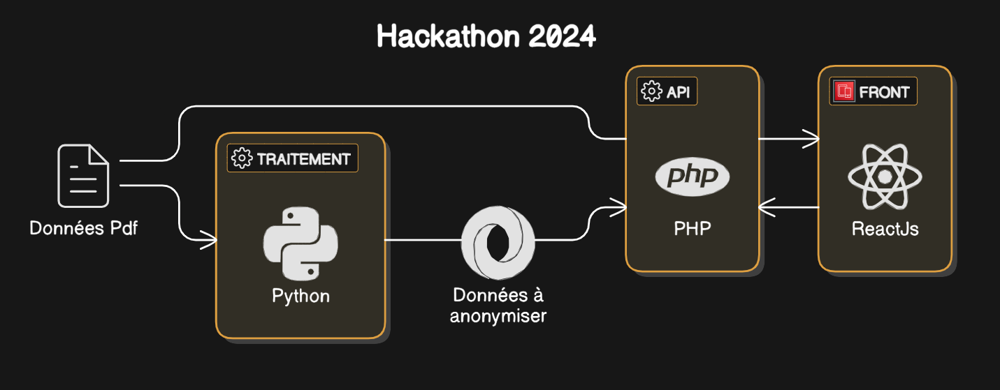

# Hackathon 2024

> SAGES, Application de pseudonymisation de fichier PDF

- [Bathily Yahaya](https://github.com/yahvya)
- [Belarif Louisa](https://github.com/belariflouiza)
- [Menghi Anthony](https://github.com/antocreadev)
- [Farelle Megane](https://github.com/MeganeFarelle)

## Outils utilisés

### Api

- OpenApi
- Php natif
- Python
- ReactJs



#### Spécifications
> L'écriture des spécifications a été réalisé à l'aide du formalisme de description OpenApi. Ce format permet de générer la documentation ainsi que les collections Postman mais également, de générer un site de documentation.

#### Implémentation

> Php dans sa version native a été utilisé afin de s'intégrer au mieux à la stack technique de SAGES pour implémenter le lien avec le front end. 

> Python pour le traitement du texte et la pseudonymisation.

#### Front end
> React a été utilisé pour réaliser un front end rapide, de même, afin de s'intégrer à la stack technique de l'entreprise

## Intégration de l'utilitaire dans un projet

- Les classes PHP ont été implémentés au format "psr-4", ce qui permet de copier le package et de le coller dans n'importe quel projet PHP usant de composer.
```
"psr-4": {
    "PdfPseudoApp\\DataExtraction\\": "src/pdf-pseudo-app/data-extraction",
    "PdfPseudoApp\\App\\": "src/pdf-pseudo-app/app",
    "PdfPseudoApp\\Utils\\": "src/pdf-pseudo-app/utils"
}
```
- Ajoutez ensuite les librairies externes utilisées en copiant les commandes ci-dessous
```
composer dumpautoload -o
```
- Vous trouverez l'exemple d'utilisation dans le controller ***src/controllers/PdfPseudoAppController***